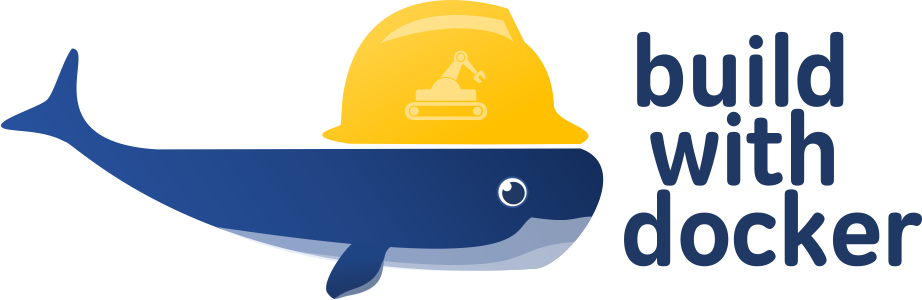

# Build With Docker

Build With Docker provides a reuseable set of scripts/Makefiles make it easier
to compile, test, package, and run robotics libraries, modules, and apps using
Docker container technology.

Build with Docker comes with scripts to drive native CMake projects, as well as
ROS/Catkin workspaces, or stacks.

Features include:

- compile and cross-compile to non-native architectures
- run automated testing
- run code scanning/static code analysis
- create Unix packages
- create and publish buildtime and runtime Docker images for deployment
- run container-based apps for development purposes
- support for both `docker` and `nvidia-docker`

## Getting Started

[Getting Started Guide](docs/getting-started.md)

## How to Use

[APIs Reference](docs/api.md)

Example:
> see [template app](https://github.com/GERobotics/template_app_ros) for an
> example using `build_with_docker` with a ROS workspace.
